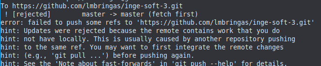
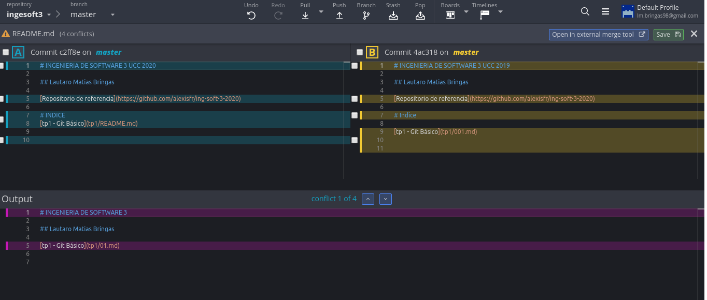

# PULL REQUEST

Un **pull request** es una petición para integrar nuestras propuestas o cambios de código a un proyecto. 

# MERGE

Al intentar hacer un push aparece un error de que hay una version mas nueva en el servidor y pide que hagamos un pull antes de hacer un push. Al hacer esto vamos a tener un conflicto ya que se fue modificado el mismo archivo mismas lineas.

Para solucionar el conflicto use GitKraken.

Git realiza un three-way merge, encontrando el ancestro común de las dos ramas que está fusionando. Cuando invoca git mergetool en un conflicto, producirá estos archivos adecuados para introducirlos en una herramienta típica de 3-way merge.

* **LOCAL**: el lado "nuestro" del conflicto. 
* **REMOTE**: su lado del conflicto.  
* **BASE**: "ancentro" en comun.