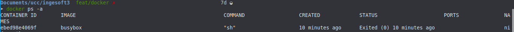

# DOCKER 

Al ejecutar el siguiente comando no se ejecuta nada ya que el entrypoint del container espera argumentos para ser ejecutados.

``` 
docker run busybox

```


El siguiente comando nos muestra lista de container junto con su id, y su estado entre otros datos.
``` 
docker ps -a

```



```
docker run -it busybox sh
```


## PUBLICANDO PUERTOS

```
docker run -d daviey/nyan-cat-web
docker run -d -p 80:80 daviey/nyan-cat-web
```
En el primer comando generamos un container apartir de la imagen ```daviey/nyan-cat-web``` pero no exponemos ningun puerto para podes acceder a este container. En el segundo comando ya exponemos el pueto 80 nuestro con el 80 del container y asi tenemos acceso.


## Explicar que se logro con el comando docker run y docker exec ejecutados en este ejercicio.

```docker run ``` genera con container a partir de la imagen que le pasemos. ```docker exec```  ejecuta un comando dentro del container.
