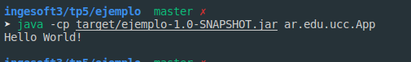

# Introduccion a Maven

## Que es Maven ?

Maven es una herramienta de software para la gestión y construcción de proyectos Java. 

## Qué es el archivo POM? 

Project Object Model (POM), es un fichero XML, que es la “unidad” principal de un proyecto Maven. Contiene información a cerca del proyecto, fuentes, test, dependencias, plugins, version.

* modelVersion: es la version del modelo de POM.
* groupId: el id del grupo del proyecto.
* artifactId: el id del proyecto.
* versionId: la version del proyecto.

# Repositorios Local Central, Remotos.

* Local: el repositorio local es el directorio en la computadora donde corre Maven. Tiene propio cache.
* Remoto:  se refieren a cualquier otro tipo de repositorio, al que se accede mediante una variedad de protocolos como ```file://``` y ```https://```.
* Central: es el repositorio proviste por la comunidad Maven. Contiene una gran cantidad de librerias comunes.

#  Ciclos de vida de build

* default: maneja el deployment del proyecto.
* clean: Elimina todos los .class y .jar generados. Después de este comando se puede comenzar un compilado desde cero.
* site: Genera un sitio web con la información de nuestro proyecto. Dicha información debe escribirse en el fichero pom.xml y ficheros .apt separados.

# POM

El comanco ``` mvn clean install ``` genero el jar corresponfiente a la configuracion del pom.xml.

# Maven Continuación

El siguiente comando ``` mvn archetype:generate -DgroupId=ar.edu.ucc -DartifactId=ejemplo -DarchetypeArtifactId=maven-archetype-quickstart -DinteractiveMode=false``` genero un proyecto java con una estructura especifica desde un template. ar/edu/ucc.

```mvn clean package``` compilamos el proyecto y generamos un build .jar en la carpeta target.

Se ejecuto con exito!!! 😀😀😀




Al generar el proyecto **ejemplo-uber-jar** agregar las linesas extrar de logging y compilarlo obtenemos un error ya que no se especifico la dependencia en el pom.xml.

# NodeJS

NPM maneja las dependencias poniendolas en el archivo package.json, en la carpeta node_module se guardan los modulos requeridos para correr el programa. A su vez se genera un package-lock.json que es un snapshot en el momento dado de cada dependencia para mayor consistencia.

# Python

```cookiecutter``` es una herramienta escrita en Python para generar template de proyecto y luego crear proyectos desde un template. 

```make``` es una herramienta de gestión de dependencias, típicamente, las que existen entre los archivos que componen el código fuente de un programa, para dirigir su recompilación o "generación" automáticamente. Se crea un archivo Makefile donde especifica los pasos a seguir como si fuera una receta.

```pip``` es un sistema de gestión de paquetes utilizado para instalar y administrar paquetes de software escritos en Python.

# Build tools para otros lenguajes

* C/C++: [Conan](https://conan.io/)
* Python: [Poetry](https://python-poetry.org/)
* JavaScript: [Yarn](https://yarnpkg.com/)
* PHP: [Composer](https://getcomposer.org/)
* Go: [dep](https://github.com/golang/dep)
* Perl: [ppm](https://code.activestate.com/ppm/)
* Ruby: [Gems](https://rubygems.org/)
* Dart: [Dart Packages](https://pub.dev/)
* Swift: [
Package Manager
](https://swift.org/package-manager/)
* C#: [Nuget](https://www.nuget.org/)