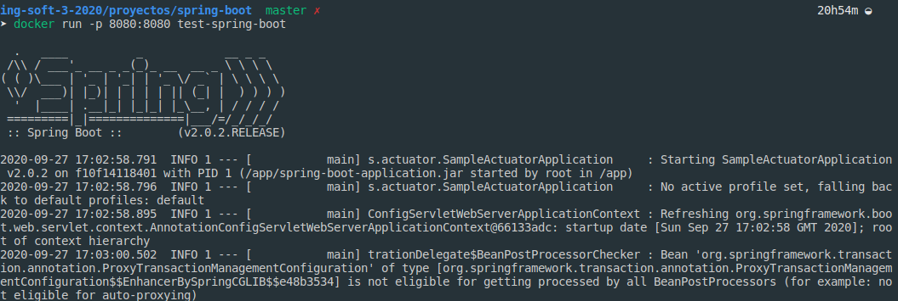
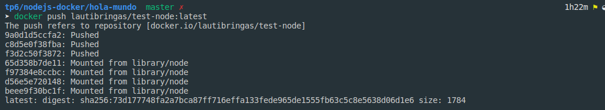
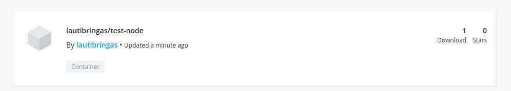

# Construcción de Imágenes de Docker

## Conceptos de Dockerfiles

* FROM: inicializa un nuevo **stage** y fija la imagen base por la cual se va empezar. Todo Dockerfile para que sea valido empieza con un **FROM**
* RUN: este comando va a ejecutar cualquier comando que se le pase como argumento sobre la actual imagen.
* ADD: copia archivos remotos o locales hacia el filesystem del container.
* COPY: tambien copia archivos pero no puede ser remotos solo locales.
* EXPOSE: es una forma de documentar los puertos que se va necesitar abrir para la ejecucion de la imagen. Este informa a docker que ese container tiene que escuchar en ese puerto especifico de la red.
* CMD: provee comando por defecto para ejecutorar sobre el container. Solo puede haber un CMD en un Dockerfile.
* ENTRYPOINT: permite configurar un conatiner que corra como ejecutable.

## Generar imagen de docker


🤢🤢🤢 anda..



##  Dockerfiles Multi Etapas

En la primera parte de este Dockerfile multi etapas copiamos los archivos necesarios para descargar las dependencias que necesitamos para que nuestro sistema pueda funcionar.

```
FROM maven:3.5.2-jdk-8-alpine AS MAVEN_TOOL_CHAIN
COPY pom.xml /tmp/
RUN mvn -B dependency:go-offline -f /tmp/pom.xml -s /usr/share/maven/ref/settings-docker.xml
```

Luego generamos el build de nuestra apliacion copiando los archivos fuentes y corriengo el build.

```
COPY src /tmp/src/
WORKDIR /tmp/
RUN mvn -B -s /usr/share/maven/ref/settings-docker.xml package

```

Por ultimo corremos nuestra aplicacion.

```
FROM java:8-jre-alpine

EXPOSE 8080

RUN mkdir /app
COPY --from=MAVEN_TOOL_CHAIN /tmp/target/*.jar /app/spring-boot-application.jar

ENV JAVA_OPTS="-Xms32m -Xmx128m"

ENTRYPOINT exec java $JAVA_OPTS -Djava.security.egd=file:/dev/./urandom -jar /app/spring-boot-application.jar

HEALTHCHECK --interval=1m --timeout=3s CMD wget -q -T 3 -s http://localhost:8080/actuator/health/ || exit 1
```

Esto nos trae las ventajas que si no se mofica las dependencias esa etapa queda cacheada.

**HEALTHCHECK** le dice a Docker como probar el container para verificar si esta andando.

## Python Flask

Al ejecutar el ```docker-compose``` se contruyo la imagen para ejecutar el codigo en Python y tambien se genero un servicio Redis. La key ```build.context``` especifica la ruta a docker donde tiene que buscar el docker file para hacer un build del Dockerfile.  


 # Publicar la imagen en Docker Hub

 
 
